# Dishcovery

Dishcovery is an iOS application that helps users discover restaurants by simply pointing their camera at a restaurant logo or storefront sign. Instead of manually searching for a place, the app detects the restaurant, finds the nearest matching branch, and displays useful information such as reviews, menus, favorites, and translated content based on the user’s preferred language.

## Features

- Camera-based restaurant detection
- Logo detection using Google Cloud Vision
- OCR fallback using Google Cloud Vision Text Detection and Apple Vision
- Nearby branch resolution using Google Places API
- Google reviews display
- Structured menu retrieval from a local menu dataset
- Review and menu translation support
- Favorites system
- User authentication
- User-submitted app reviews
- Automatic review rating prediction using a deployed DistilBERT-based NLP model

## How It Works

1. The user opens the app and scans a restaurant storefront.
2. The app attempts to detect the restaurant logo.
3. If logo detection is not enough, OCR is used as a fallback to read text from the image.
4. The detected restaurant name is combined with the user’s location.
5. Google Places is used to find the nearest matching branch.
6. The app displays the detected result, reviews, menu, and related information.
7. Users can translate reviews and menus into their preferred language.
8. Users can also submit app reviews, where the rating is predicted automatically by a deployed machine learning model.

## Tech Stack

### iOS
- Swift
- SwiftUI
- AVFoundation
- Vision Framework
- Core Location

### Backend / Cloud Services
- Google Cloud Vision API
- Google Places API
- Firebase Authentication
- Firebase Firestore
- Firebase Cloud Functions
- Google Cloud Translation API
- Render for model deployment

### Machine Learning
- DistilBERT for review rating prediction
- GAN-based data augmentation for improving class balance

## Project Structure

Typical app components include:

- **Authentication** for sign up, login, and user sessions
- **Camera and scanning flow** for capturing restaurant images
- **Detection pipeline** for logo and text recognition
- **Restaurant resolution** for matching detected names to nearby branches
- **Reviews and menu tabs** for restaurant information
- **Translation layer** for multilingual support
- **Favorites system** for saving restaurants
- **Review prediction service** for rating user-written reviews

## Machine Learning Model

Dishcovery includes an NLP-based review rating prediction model that predicts a star rating from user-written review text.

- Base model: DistilBERT
- Task: 5-class review rating classification
- Improvement approach: GAN-based augmentation for underrepresented classes
- Deployment: Render-hosted API

### Related Repositories / Links

- Hugging Face model: [Review BERT Model](https://huggingface.co/selimhafez/review-bert-model)
- Rating API repository: [RatingApi](https://github.com/Selimhafez1/RatingApi)

## APIs and Services Used

- **Google Cloud Vision API**  
  Used for logo detection and text detection.

- **Google Places API**  
  Used to resolve the detected restaurant to the nearest branch and retrieve place details.

- **Firebase Authentication**  
  Used for user sign up and login.

- **Firebase Firestore**  
  Used for storing app data such as reviews, favorites, and user preferences.

- **Firebase Cloud Functions**  
  Used for handling translation requests.

- **Google Cloud Translation API**  
  Used to translate reviews, menu items, and other dynamic text.

- **Render Deployment**  
  Used to host the review rating prediction API.

## Menu Dataset

Dishcovery also uses a locally prepared restaurant menu dataset to display menu items inside the app. This dataset was built from scraped restaurant menu data and preprocessed to improve matching accuracy between detected restaurant names and stored menu records.

Because the app supports multilingual environments, extra normalization was applied to handle:
- Arabic and English restaurant names
- Duplicate menu entries
- Currency normalization
- Translation support for menu items

## Application Screenshots

The following screenshots show the Dishcovery user journey from login, scanning, review interaction, menu browsing, favorites, and multilingual translation support.

### 1. Login

  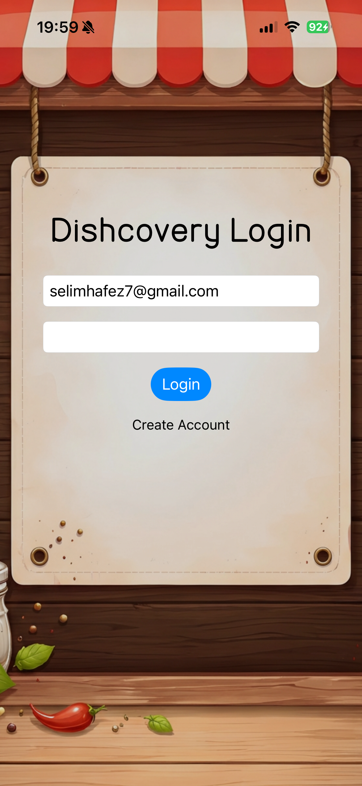

### 2. Home

  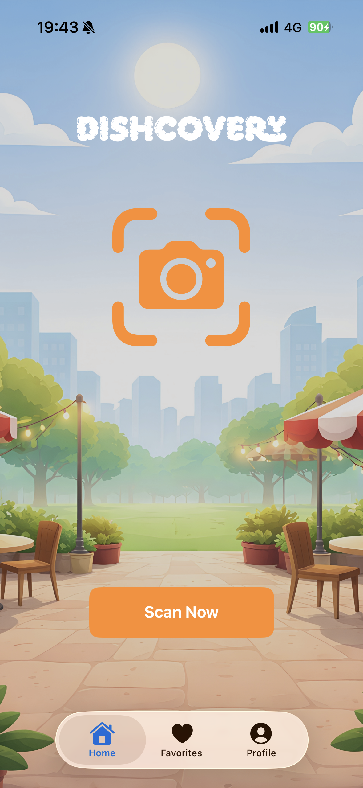

### 3. Detected Result

  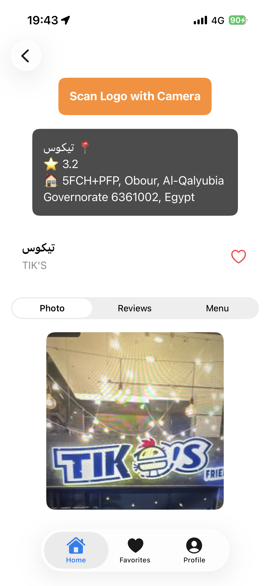

### 4. Reviews Tab

  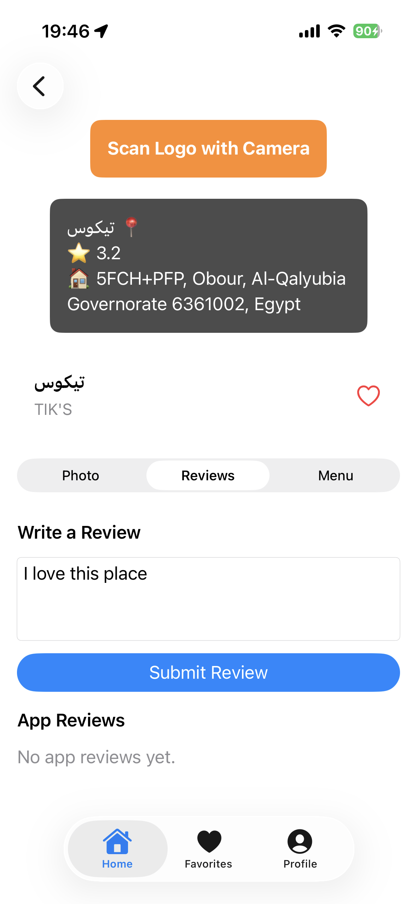

### 5. Review Submitted

  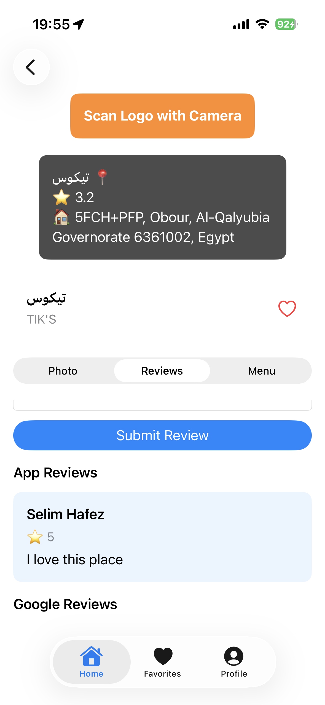

### 6. Menu Tab

  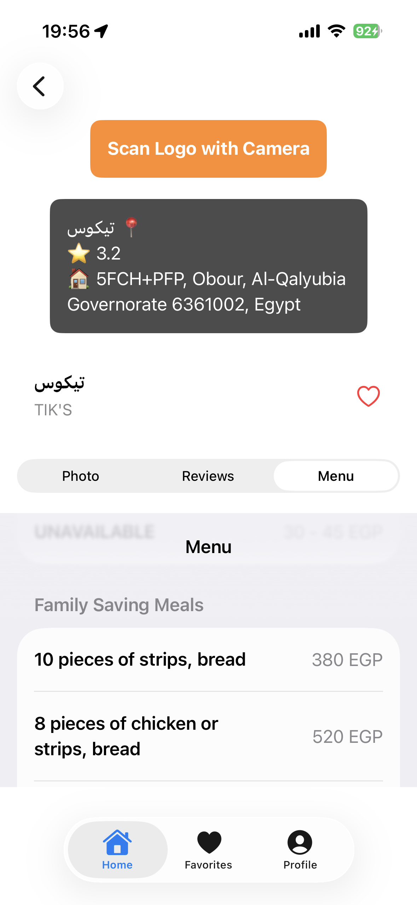

### 7. Added to Favorites

  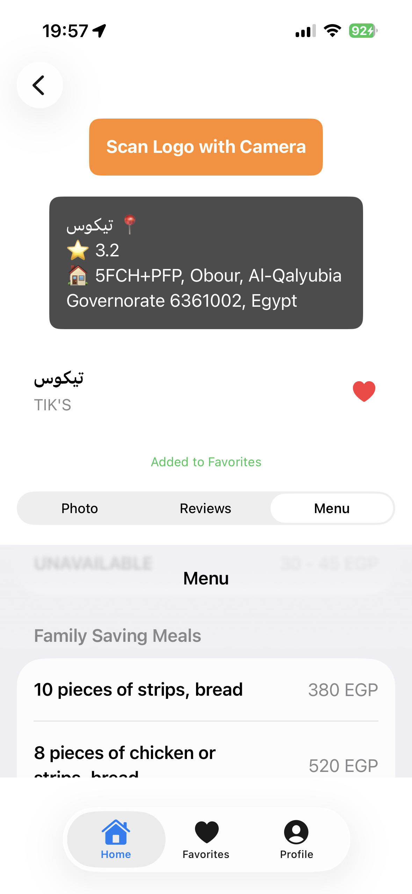

### 8. Favorites Tab

  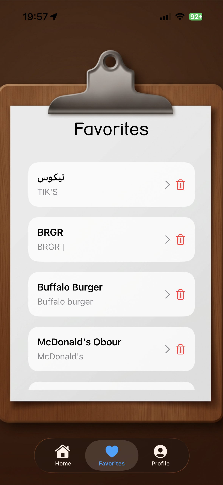

### 9. Translated Profile Tab

  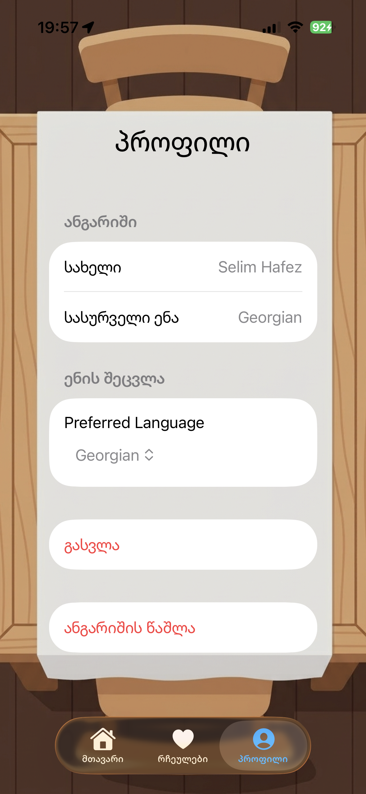

### 10. Translated Reviews

  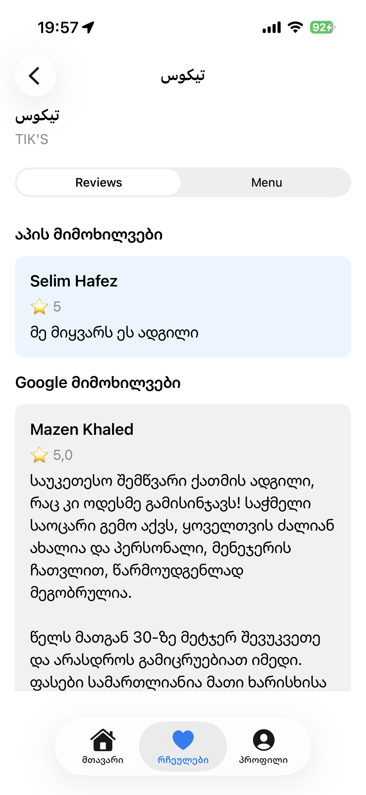

### 11. Translated Menu

  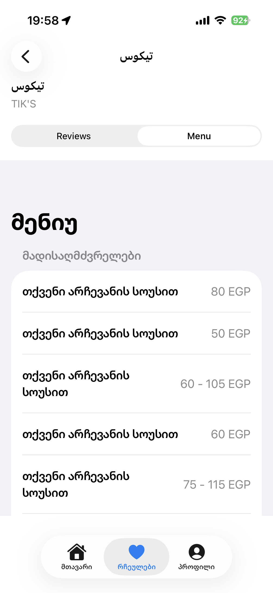

